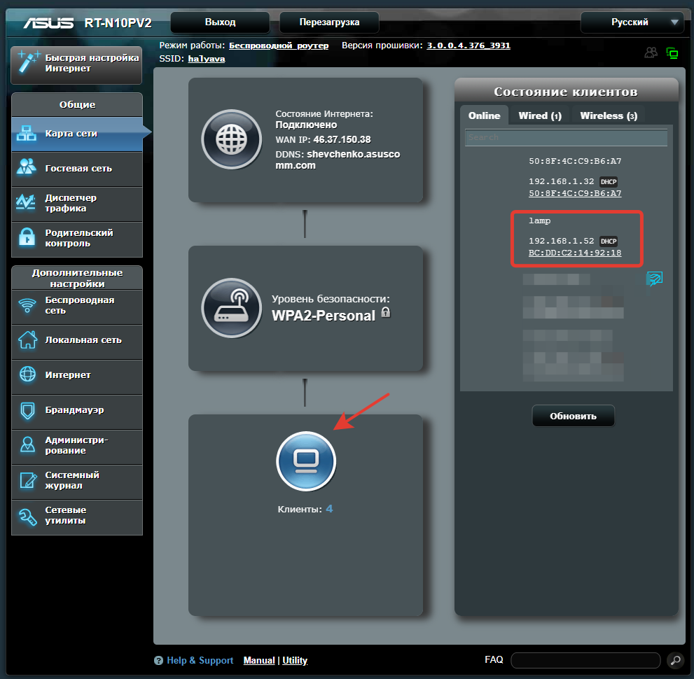

# Инструкция по пользованию wifi-лампой

## Характеристики

- Стеклянный корпус
- 256 цветных светодиодов
- 21 режим работы (эффект)
- Питание DC 5V 4A
- Настройка скорости, яркости и масштаба для каждого эффекта
- Получение точного времени из интернета
- Сенсорная кнопка управления вверху лампы
  - Смена режима
  - Настройка яркости
  - ВКЛ / ВЫКЛ 
- Возможность управления по WIFI
- Подключение к домашней WIFI сети
- Умный будильник-рассвет, на каждый день недели, настройка через приложение

## Управление кнопкой
- Одиночный клик: выкл/выкл свет, также выключение рассвета
- Двойной клик: смена режима
- Тройной клик: смена режима назад
- Удержание: смена яркости

## Управление приложением

- В приложении можно настроить параметры текущего эффекта или сменить эффект на другой. После смены эффекта или изменения его параметров настройки сохраняются в энергонезависимую память лампы через 30 секунд. При смене эффекта настройки сразу же сохраняются.
- В приложении можно настроить 7 будильников на каждый день недели. При открытии окна будильников текущие параметры будильников подгружаются из лампы. После изменения состояния будильника или его времени настройки сразу же сохраняются в энергонезависимую память лампы, т.е. лампе не страшно отключение питания.
- Логика работы будильника такая: свет плавно включается за указанное время до будильника, разгорается до максимума ко времени будильника, и горит так ещё 1 минуту, затем отключается. Прервать рассвет можно кликом по кнопке на корпусе. Звуковых сигналов при этом не подается. Задача будильника - симулировать утренний рассвет, а к моменту Вашего пробуждения наполнить комнату светом.

## Первоначальная настройка WiFi
Лампа работает в домашней сети, но ей нужно указать к какой сети подключаться и задать пароль.

Так как изначально лампа не знает пароль Вашей домашней wifi-сети, то при первом включении создается временная wifi-сеть под названием `AutoConnectAP` и паролем `12345678`, в этой сети доступна страница для ввода данных домашнего wifi. Введенные настройки сохраняются в памяти лампы и используются при следующих запусках. Последовательность настройки следующая:

1. Включаем лампу в розетку
2. С телефона ищем сеть `AutoConnectAP`
3. Подключаемся, вводим пароль `12345678`
4. После подключения в телефоне откроется окно
  
  

5. Нажимаем `Configure WIFI`.
6. Лампа просканирует досрупные сети и предложит список доступных.
  
  

7. Выберите нужную сеть, введите пароль от выбранной сети в поле `password`
8. Нажмите `save`
9. Точка попытается подключиться к выбранной сети. Если всё сделано верно, сеть `AutoConnectAP` исчезнет, а лампа подключится к интернету. Если сеть не исчезла, значит подключение не удалось - проверьте правильность ввода пароля, и повторите действия с шага 2.

## Настройка приложения

Лампа может работать с двумя приложениями, которые отличаются набором поддерживаемых режимов. Для корректной работы телефон должен быть подключен к той же WiFi сети, что и лампа. Через мобильную сеть приложение не работает!

### Приложение `Управление лампой`
Приложение доступно по [ссылке](https://github.com/uyras/ledlampcontrol/releases/download/0.1/ledlampcontrol-v0.1.apk). В нем доступны все режимы.

В настройках телефона, в разделе "безопасность", нужно отметить галочку "Разрешить установку приложений из неизвестных источников".

Для установки нужно сперва загрузить apk-файл в телефон. Затем открыть его через любой файловый менеджер. Более подробно описано в статье [на сайте wikihow](https://ru.wikihow.com/%D1%83%D1%81%D1%82%D0%B0%D0%BD%D0%BE%D0%B2%D0%B8%D1%82%D1%8C-APK%E2%80%93%D1%84%D0%B0%D0%B9%D0%BB-%D1%81-%D0%BA%D0%BE%D0%BC%D0%BF%D1%8C%D1%8E%D1%82%D0%B5%D1%80%D0%B0-%D0%BD%D0%B0-Android).

После установки вернуть обратно галочку "Разрешить установку приложений из неизвестных источников" в настройках телефона.

Запускаем приложение, жмем "Настройки" и "Проверить подключение". Если связь есть, то внизу экрата появится мелкая серая надпись "ok". В случае ошибки "error" читайте раздел "настройка адреса лампы".

### Приложение `GyverLamp`
Доступно в [Google Play](https://play.google.com/store/apps/details?id=com.beragumbo.GyverLamp&hl=ru). Работают только 18 режимов. Не поддерживаются "часы", "ночник" и "патриот". Как вариант, отсутствующие режимы можно переключить кнопкой на лампе, а яркость/скорость/масштаб настраивать в приложении.

При первом запуске нажать кнопку настроек (верхний правый угол), и в поле IP ввести `lamp`. Порт `8888`. Нажать кнопку "Получить настройки". Если всё успешно, в зеленом поле появится текст "Подключен". В случае ошибки читайте раздел "настройка адреса лампы".

## Настройка адреса лампы

При подключении к WiFi, лампа получает свой IP адрес, и регистрирует в точке доступа связанное с этим адресом DNS-имя `lamp`. В приложениях в поле адреса можно ввести как IP адрес, дак и DNS-имя.

Приоритетней использовать DNS-имя. Если приложения не находят лампу по имени, стоит подождать до 30 минут. Возможно, точка доступа ещё не обновила список имен всех подключенных к ней устройств.

IP адрес записывается в виде 4 чисел от 0 до 255, разделенных точкой. Например `192.168.1.10`. При каждом подключении лампы к сети ей выдается новый адрес. Чтобы узнать адрес, заходим в панель управления точкой доступа.
Жмем по кнопке "Клиенты". В списке клиентов будет лампа с соответствующим IP адресом. 

Можно настроить точку доступа так, чтобы она выдавала всегда лампе один и тот же адрес.
1. Заходим в раздел "Локальная сеть"
2. Вкладка DHCP-сервер. Внизу страницы будет "Список присвоенных вручную IP-адресов в обход DHCP".
3. Выбираем MAC-адресс из списка подключенных устройств
4. Вводим IP адресс, например `192.168.1.205`
5. Жмем `+` для добавления
6. Жмем кнопку "Применить" внизу страницы

После настройки нужно перезагрузить точку доступа, затем лампу. В настройках приложения в качестве адреса можно вводить указанный IP.
